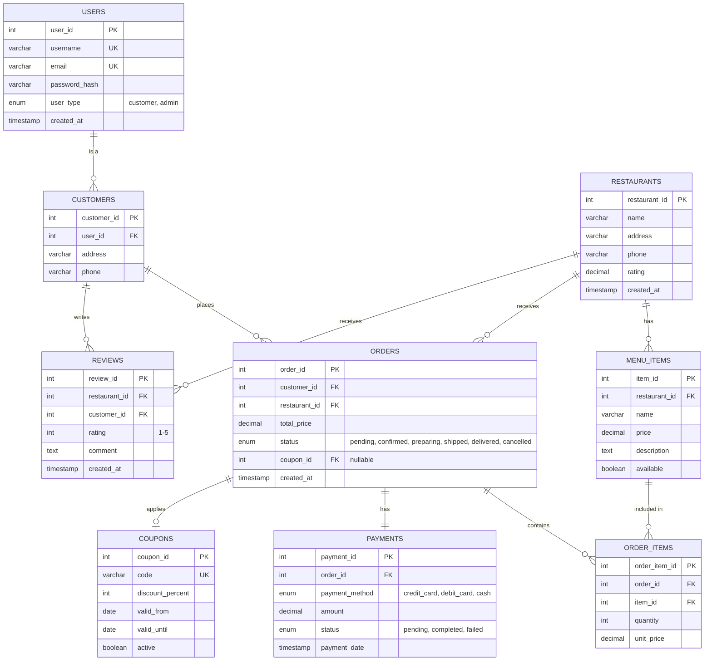

# Entity-Relationship Diagram — Online Food Ordering System

This ER diagram shows the database schema and relationships between entities.

## Relationships Summary

| From | To | Relationship | Description |
|------|------|------------|-------------|
| USERS | CUSTOMERS | 1:1 | A user can be a customer (inheritance) |
| CUSTOMERS | ORDERS | 1:N | A customer can place many orders |
| CUSTOMERS | REVIEWS | 1:N | A customer can write many reviews |
| RESTAURANTS | MENU_ITEMS | 1:N | A restaurant has many menu items |
| RESTAURANTS | ORDERS | 1:N | A restaurant receives many orders |
| RESTAURANTS | REVIEWS | 1:N | A restaurant can have many reviews |
| ORDERS | ORDER_ITEMS | 1:N | An order contains many order items |
| ORDERS | PAYMENTS | 1:1 | Each order has one payment |
| ORDERS | COUPONS | N:1 (optional) | An order can apply one coupon |
| MENU_ITEMS | ORDER_ITEMS | 1:N | A menu item can be in many order items |

## Database Design Notes

- **users** table stores base authentication info
- **customers** table extends users with address and phone (OOP inheritance pattern)
- **password_hash** uses bcrypt or similar hashing (not plain text)
- **rating** in restaurants is calculated from reviews (average)
- **unit_price** in order_items stores the price at time of order (historical data)
- **coupon_id** in orders is nullable (optional feature)
- Timestamps track creation dates for audit trails
